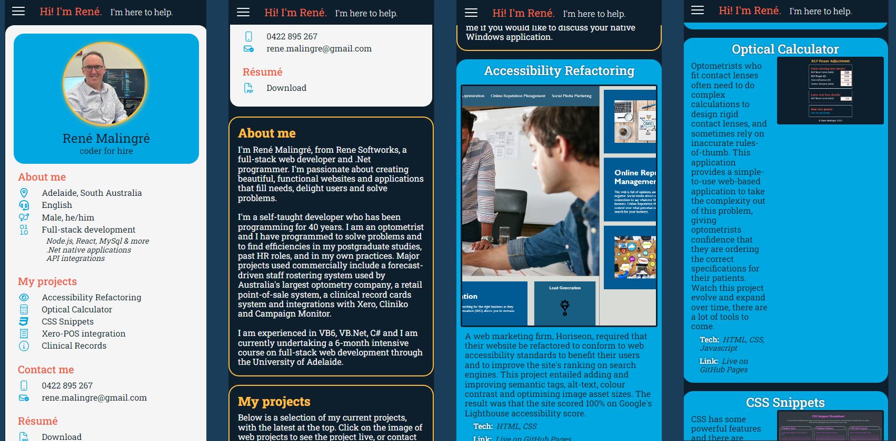

# Rene Softworks Portfolio

This project is a responsive portfolio website showcasing current development work, built using advanced CSS techniques such as CSS flexbox, grid, media queries, and CSS variables.

It is aimed at showcasing the developer's work and skills to potential employers and clients. This project is part of the University of Adelaide's Full Stack Web Development Bootcamp,
and it showcases projects that the developer has worked on during the course of the bootcamp. As placeholders, there are currently screenshots of native Windows applications that the developer has previously created,
to be replaced in the portfolio by bootcamp projects as the bootcamp course progresses.

There are links to the deployed applications directly from the portfolio website.

## Table of Contents

- [Screenshots](#screenshots)
- [Live URL](#live-url)
- [Features](#features)
- [Technologies Used](#technologies-used)
- [Installation](#installation-or-usage)
- [Credits](#credits)
- [License](#license)

## Screenshots

**Note:** The screenshots below are of the portfolio website in different screen sizes. The website is responsive and will adapt to the screen size of the device it is being viewed on.

### Large Screens

Examples of the reformatting of the content for large screens:

### Medium Screens

Example of the reformatting of the content for medium screens:

### Small Screens

Examples of the responsive navigation menu and reformatting of the content for small screens:

## Live URL

The website is hosted on GitHub Pages at the live URL: [renemalingre.github.io/ReneSoftworks/](https://renemalingre.github.io/ReneSoftworks/)

## Features

This project demonstrates the following:

- The developer's name (René Malingré) and a recent photo or avatar.
- It has links to sections about the developer, their work, and how to contact them. It also contains a link to a PDF copy of the developer's resume.
- Clicking on the navigation links scrolls the UI to the corresponding section or takes the user to files or external websites.
- A section with a portfolio of the developer's applications, with titled images displayed, accessible by clicking on navigation links.
- The first portfolio's application's image is larger in size than the others.
- Clicking on the images of the applications takes the user to the deployed application.
- A responsive layout that adapts to various screens and devices is presented when the page is resized or viewed on different devices.

## Technologies Used

- HTML
- CSS
  - Flexbox
  - Grid
  - Media Queries
  - CSS Variables

## Installation or Usage

1. Clone the repository to your local machine.

2. Open the `index.html` file in your browser to view the portfolio website.

Alternatively:

1. Open the live URL in your browser to view the portfolio website: Live URL: [renemalingre.github.io/ReneSoftworks/](https://renemalingre.github.io/ReneSoftworks/)

## Credits

### CSS Advice, Tricks and Resources

Kevin Powell's extremely clear tutorials on YouTube, such as this tutorial on responsive navigation without javascript: [YouTube](https://youtu.be/8QKOaTYvYUA)

Font Awesome for the wide variety of svg icons available to enhance the UI design: [Font Awesome](https://fontawesome.com/)

OpenAI's ChatGPT for the advice and examples that seem to be much quicker and clearer than searching google for the same thing; [OpenAI](https://openai.com/)

Normalize.css v8.0.1 for the CSS reset: [Normalize.css](https://necolas.github.io/normalize.css/)

## License

This project is licensed under the terms of the MIT license.
